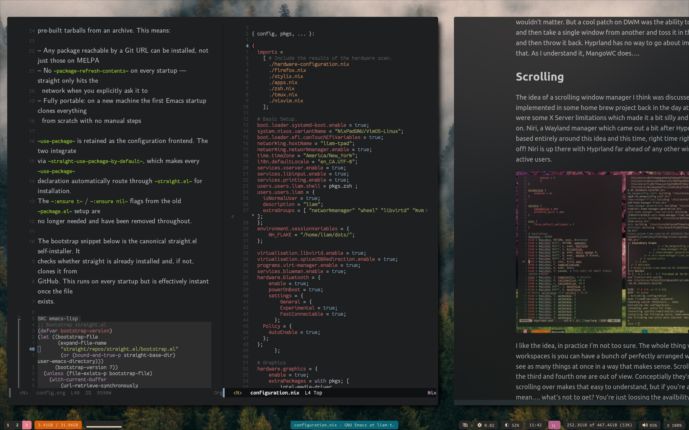

# Liam's NixOS Dotfiles

Boi oh boi 'tis been ages since I've bothered to figure out how to get back on here and get this goin'. My last [Github Repo Here](https://github.com/mahallow/thinkdots) is like 5 plus years old now. I've still been on ye ole Nix/Vim/Linux setup but lost access to that account and therefore just stopped because I didn't do too much to my setup between the last commit and then. Or so I thought...

## NixOS Still, Hyprland Now

Gone are the days of XMonad and XMobar. Since realizing I could try Wayland, and really my computer is pretty simply used but a few of my 20+ year experience on Linux pain points were due to Xorg, I gave Hyprland a try and have found the quality of life for normal desktop use to be worth the hassle of switching window managers. That being said, I am MangoWC curious as it has the ability to add in a few things from XMonad I had configured which I grew used to. 


## Now with Flakes!

With much assistance from [Evan over here](https://github.com/evanrelf) I've now migrated over to a flakes based setup. Not entirely sure how it's working necessarily but at least it is working and I know enough to reproduce it!

To reproduce this on a fresh NixOS install simple clone the repo, cp -r nixdots/config/* .config/ to your local machine, enable flakes in the stock configuration.nix and then rebuild with sudo nixos-rebuild switch --flake .#your-hostname and if I'm not mistaken, you'll be rockin' the same setup as I.

## Now With NixVim

After getting back into the whole customVim thing trying to add some Lua to my 10 year old .vimrc which I shoved into the ```/etc/nixos/vim.nix``` file, I found out and learned how to configure NixVim! How sick is that hey, it works well, my pretty simple setup was relativly easy to port over and I don't know why you'd do anything else on Nixos. 

# Anyways

Thanks for looking! I hope to keep this more up to date as it is rather handy having a way to reference changes over time for these sorts of things. Check out [my site for more detailed explinations](https://heinicke.xyz) and breakdowns of how the configuration works and philosophies behind some choices. 

